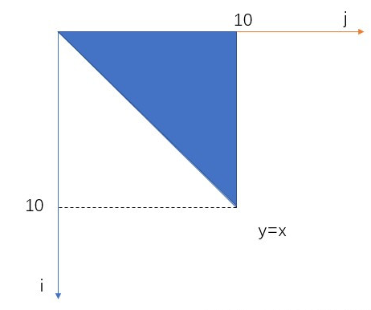
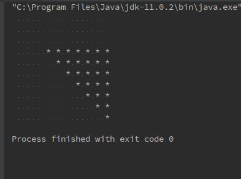

# 双重for循环在控制台话任意图形

### 想必会让你多初学者学习编程的时候都会遇到这么一个作业:
- 1、用双重for循环打印一个菱形
- 2、打印九九乘法表

### 那么我们怎么去分析这道题目呢?
1. 首先建立一个双重for循环：
2. 外层的for循环，每循环一次输出一行（ System.out.println() ），达到换行的效果
3. 内层的for循环，每循环一次输出一列（ System.out.print("* “) 或者 System.out.print(” ")），注意不用换行
#### 分析：数学直角坐标的转换，学过数学的同学都懂的<- _ <-
1. 从中我们可以看出，外层循环就相当于y轴，内层循环就相当于x轴。只不过这里y轴正方向向下乐而已
2. if里面的条件就相当于函数的方程，当满足“方程”的时候，就打印输出一个 “ * ”，否则就打印空（转换成数学
的y(i)-x(j)<0，也就是 y=x 这条直线的上方，注意：这里的 y 是 j 变量，x 是 i 变量，y轴正方向向下，所以是y=x的上方)
+ 示意图

```java
 package com.forskill;
 
 /**
  * @author hallele
  * @date 2019/05/02 15:21
  * @description version 1.0
  */
 public class Skill {
     /**
      * 定义x,y轴的最大坐标值
      */
     private static final int MAX = 10;
 
     /**
      * 主方法
      *
      * @param args *
      */
     public static void main(String[] args) {
         //外层循环控制行(y轴)
         for (int y = 0; y < MAX; y++) {
 
             //内层循环控制列(x轴)
             for (int x = 0; x < MAX; x++) {
 
                 //函数表达式集合
                 boolean[] booleans = {y - x <= 0 && y >= 3};
                 boolean flag = false;
 
                 //取所有表达式并集,即所有函数图像的并集
                 for (boolean aBoolean : booleans) {
                     flag = aBoolean || flag;
                 }
 
                 //满足并集条件就打印*,前面加空格是因为控制台行间距和列间距大小不同,加上保持美观
                 //不满足就打印空格
                 if (flag) {
                     System.out.print(" *");
                 } else {
                     System.out.print("  ");
                 }
             }
 
             //换行
             System.out.println();
         }
     }
 }

```
### 所以最终的结果为

